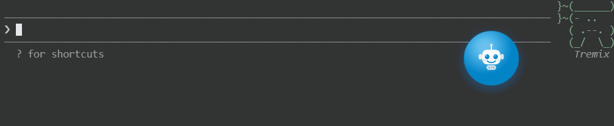

# AI Notifier

[中文](#中文) | [English](#english)

<p align="center">
  
</p>

---

## 中文

### 简介

AI Notifier 是一个轻量级 Windows 桌面悬浮球工具，当 AI 编程助手（可一键绑定 Claude Code，可通过 HTTP 请求手动触发，方便集成其他工具）完成任务或发送通知时，通过声音和视觉动画提醒你。

再也不用盯着屏幕等 AI 回复了 — 去喝杯咖啡，AI 搞定了会叫你。

### 功能特性

- **悬浮球**：天蓝小机器人悬浮球，始终置顶，可拖拽。4 种状态颜色 — 天蓝（监听中）、灰色（已关闭）、琥珀（回应完毕）、紫色（通知）
- **双类型提醒**：回应完毕提醒 & 通知提醒，可独立开关，各自音效
- **长/短提醒模式**：长提醒循环播放直到你回来；短提醒播放一次
- **渐强音量**：提醒声从小到大，不会吓你一跳
- **碎碎念**：AI 思考时弹出小气泡，提醒你喝水、站起来走走。内容可自定义，也可设为定时提醒，适合番茄钟等场景
- **项目通知气泡**：显示是哪个项目的 AI 完成了任务，多项目并行时一目了然
- **Claude Code 一键绑定**：自动配置 hooks，零手动配置
- **音效自定义**：4 个内置音效 + 支持自定义 WAV 文件
- **多语言**：中文 / English，自动检测系统语言
- **开机自启**：可选

### 安装

从 [Releases](../../releases) 下载最新版本的 zip 包，解压到任意目录，双击 `AiNotifier.exe` 运行。

> **注意**：请下载完整的 zip 包并解压使用，不要单独复制 exe 文件 — 杀毒软件可能破坏单文件结构。

### 使用方法

1. 运行 `AiNotifier.exe`，屏幕上出现天蓝小机器人悬浮球
2. **右键悬浮球** → **绑定 Claude Code**，自动配置 hooks
3. 正常使用 Claude Code，AI 回复完毕时自动响铃提醒
4. **左键点击**悬浮球：快速切换提醒开关 / 正在响铃时点击停止

#### HTTP API

也可以通过 HTTP 请求手动触发，方便集成其他工具：

```bash
curl http://localhost:19836/stop     # 回应完毕提醒
curl http://localhost:19836/notify   # 通知提醒
curl http://localhost:19836/start    # 碎碎念
curl http://localhost:19836/status   # 查询状态
```

### 从源码构建

需要 [.NET 8 SDK](https://dotnet.microsoft.com/download/dotnet/8.0)。

```bash
# 构建
dotnet build src/AiNotifier/AiNotifier.csproj

# 发布（文件夹版本，推荐）
dotnet publish src/AiNotifier/AiNotifier.csproj -c Release -r win-x64 --self-contained -o publish/portable
```

### 系统要求

- Windows 10 / 11（x64）
- 无需安装 .NET 运行时（已内置）

---

## English

### Introduction

AI Notifier is a lightweight Windows desktop floating-ball widget that alerts you with sound and animation when an AI coding assistant (one-click binding for Claude Code, or trigger via HTTP for easy integration with other tools) finishes a task or sends a notification.

Stop staring at the screen waiting for AI to respond — grab a coffee, it'll call you when it's done.

### Features

- **Floating Ball**: A cute sky-blue robot ball, always on top, draggable. 4 state colors — sky-blue (listening), gray (off), amber (response complete), purple (notification)
- **Dual Alert Types**: Response-complete alert & notification alert, independently togglable with separate sounds
- **Long/Short Alert Modes**: Long alerts loop until you return; short alerts play once
- **Gradual Volume**: Alert sound fades in from quiet — no jump scares
- **Nudge Messages**: Bubble pop-ups during AI thinking — reminders to drink water, stretch, etc. Fully customizable content, and can also be configured as timed reminders for Pomodoro and similar workflows
- **Project Notification Bubble**: Shows which project's AI finished, great for multi-project workflows
- **One-Click Claude Code Binding**: Auto-configures hooks, zero manual setup
- **Custom Sounds**: 4 built-in sounds + custom WAV file support
- **Multi-Language**: Chinese / English, auto-detects system language
- **Auto-Start**: Optional launch on boot

### Installation

Download the latest zip from [Releases](../../releases), extract to any folder, and run `AiNotifier.exe`.

> **Note**: Download the full zip package and extract it — don't copy just the exe file alone, as antivirus software may corrupt the single-file structure.

### Usage

1. Run `AiNotifier.exe` — a sky-blue robot ball appears on screen
2. **Right-click the ball** → **Bind Claude Code** to auto-configure hooks
3. Use Claude Code as usual — you'll be alerted when AI finishes responding
4. **Left-click** the ball: toggle alerts on/off, or stop ringing when active

#### HTTP API

Trigger alerts via HTTP for integration with any tool:

```bash
curl http://localhost:19836/stop     # Response complete alert
curl http://localhost:19836/notify   # Notification alert
curl http://localhost:19836/start    # Nudge message
curl http://localhost:19836/status   # Query status
```

### Build from Source

Requires [.NET 8 SDK](https://dotnet.microsoft.com/download/dotnet/8.0).

```bash
# Build
dotnet build src/AiNotifier/AiNotifier.csproj

# Publish (portable folder, recommended)
dotnet publish src/AiNotifier/AiNotifier.csproj -c Release -r win-x64 --self-contained -o publish/portable
```

### System Requirements

- Windows 10 / 11 (x64)
- No .NET runtime installation needed (self-contained)

---

## Support / 支持

如果这个工具对你有帮助，欢迎请我喝杯咖啡 ☕

If you find this tool helpful, consider buying me a coffee ☕

<a href="https://ifdian.net/a/miss_you" target="_blank"></a>

---

## License

MIT License - see [LICENSE](LICENSE) for details.
